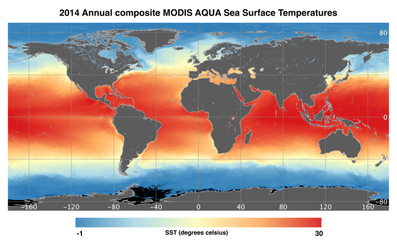

Oceancolor Data Downloader v1.0
=======================================

##What it does
This is a QGIS Plugin which allows easy download of oceancolor and sea surface temperature data from [NASA Oceancolor](http://oceancolor.gsfc.nasa.gov/). 

It downloads either global [level 3 mapped](http://oceancolor.gsfc.nasa.gov/cms/products) chlorophyll-a concentrations or sea surface temperatures within a defined time range, and resolution. The data is saved in GeoTiff format and can be added to the QGIS canvas once downloaded.  

##The data
All data is sourced from [NASA Oceancolor](http://oceancolor.gsfc.nasa.gov/). Full details on the input data can be found [here](http://oceancolor.gsfc.nasa.gov/), and includes [algorithm descriptions](http://oceancolor.gsfc.nasa.gov/cms/atbd). 

The plugin currently provides access to three datasets:

* MODIS AQUA CHL-a concentration
* SeaWiFS CHL-a concentration
* MODIS AQUA Night Sea Surface Temperatures

##Installation

The plugin requires QGIS version 2.0 or higher. It can be installed via the Plugin Manager. 

1. Navigate to `Plugins > Manage and Install Plugins...`

2. Click `Settings`

3. Add the following repository:

    `LINK TO REPO - TBC`

4. Click on `New` to see all newly available plugins. 

5. Install the plugin, named **Oceancolor Downloader**.

##Using the plugin
1.   Locate this icon on the toolbar and click it to open the plugin.

 

2. Select a **dataset**, a **time period**, a **date range** and a **download path**. Select whether you wish to add the composite to the map canvas. 

3. Click **Download**

If you have chosen to add the data to the canvas, it will appear styled once the GeoTiff is created. Sea surface temperature data will also include a seperate quality grid, but this will not be added to the canvas. 

 

##Future developments

We are currently developing new features and working to improve existing ones. A selection of features we are looking to include in a future release are as follows:

* Alternative output file formats
* Options to subset output data to a lat/long bounding box
* Other datasets, such as [Net Primary Production](http://www.science.oregonstate.edu/ocean.productivity/)
* Progress bar
* 'Cancel Download' button
* Warnings/notifications on amount of data selected to download

##Acknowledgements

The plugin was developed by the Mapping and Geographic Information Centre at [British Antarctic Survey](http://www.antarctica.ac.uk/). 

If using this plugin for work towards a publication, please cite: 
